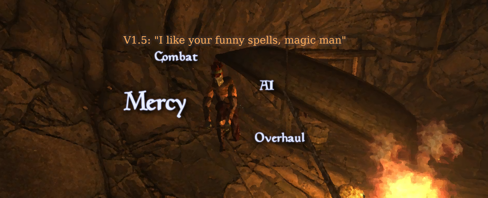

# ☮ Mercy: Combat AI Overhaul



A significant overhaul of in-combat NPC behavior for OpenMW. Using a custom Lua behavior trees library, with new voice lines and animations. Complete overhauls melee NPCs and partially overhauls spellcasters and marksmen. 

The combat doesnt always need to end in bloodshed, but when it does - it does so in _style_.

NPCs are now capable of more than chasing and stabbing. They will move around, run, walk, execute series of attacks, and use quick and charged attacks interchangeably. They might be cautious to engage or even not willing to fight anymore. Those with spellcasting ability sometimes will use a wider array of spells appropriately (such as invisibility) or even, very occasionally, use few of the very exotic special spells (quite rare, still vanilla friendly, but might be with a dash of humour, you will have to trust my sense of humour here).

The overall goal of the mod is to make the combat more engaging and entartainment as well as introduce some occasional memorable encounters that feel "different" (but not immersion-breaking).


Many new ElevenLabs-generated combat voice lines by [vonwolfe](https://next.nexusmods.com/profile/vonwolfe), currently for Dunmer, Nord and Orc (male and female) and Imperial (male) NPCs. Can be easily turned off in settings if AI slop voices grind your gears (understandably, I like them though).

<p><a href="https://ko-fi.com/maxyari"></a><a href="https://ko-fi.com/maxyari"></a><br><a href="https://ko-fi.com/maxyari"></a></p>

# ☮ Demos and Details


The gifs above show some of the new behaviours.

Now below are lists of behaviours and spells that Mercy adds, I personally consider those to be spoilers and would STRONGLY recommend to just play it and have some sense of wonder. But if you hate surprises read under the spoilers below.

<details>
<summary>Full(ish) list of behaviours</summary>

Most of them have some amount of randomisation, so different NPCs might behave slightly (or significantly) differently.

Chances of these behaviours can be increased/decreased in the mod's settings page: Options -> Scripts -> Mercy: CAO.

- Hitting an NPC alerts their friends nearby, the ones who can see it will join the fight.
- NPCs might be unwilling to engage and warn you not to come closer instead (depends on how aggressive they are and how much they like you). Come too close or attack them and they fight. If they lose sight of you - they might come looking where they last saw you, and eventually give up. Guards never hesitate.
- When unwilling to engage they migh go and investigate after loosing a sight of you, or even attempt to sneak up on you.
- Chase, fall back, strafe around in combat, walk menacingly. Rare NPCs will jump around or run around you at full speed.
- Chain attacks together, the max amount of attacks in a chain depends on their weapon skill.
- Make mistakes in picking the best attack type, more mistakes at lower weapon skill.
- Some might get angry when you keep hitting them fast and respond with a war cry and a similar quick attack spam.
- At low health (below 33%, adjustable in the settings) every hit has a chance of scaring them. A scared NPC will either run away looking for friends, or ask for mercy - giving up all the items they carry (except the clothing/armor they wear) and leaving the fight. Guards never surrender, and NPCs don't surrender to creatures.
- Your companions will usually spare enemies asking for mercy.
- NPCs might retreat from an invisible enemy.
- When casting special mercy spells that hinder you in some way - might chose to run away and hide.
- Probably other smaller things that I forgot about.

</details>

<details>
<summary>Full(ish) list of extra NPC spells</summary>

2/3 of vanilla casters get 1-2 Mercy spells
Furthermore, only 1/3 of those get an "Exotic" spell

- Blindness on target (not 100% magnitude but close to it)
- (Exotic) Blink - teleports the target to a random (reachable) 
- Chameleon 50% on self
- (Exotic) Confusion on player - flips your keyboard controls
- Invisibility on self - for repositioning or to run away and hide
- Levitation bolt - 1pt levitation and speed debuff on player
- Light - light on self with a minor agility buff
- (Exotic) Pillow fight - shoots out a cone of pillows (yes you heard that right, it looks as great as it sounds, trust me), physical damage, requires Lua Physics to be installed
- (Exotic) Skeleton jail - a projectile that spawns 4 skeletons around the target if it hits. Skeletons are very shortlived.
- Speed boost on self

</details>


## ☮ How to install

- **Requires OpenMW 0.49 or newer.**
- Install and enable [Max Yari's Script Services (MSS)](https://www.nexusmods.com/morrowind/mods/60256), it's a required dependency.
- Install this mod **with a mod organiser**: download the archive (or this repository as an archive) and drag and drop it into your mod organiser of choice (e.g [Mod Organizer 2](https://github.com/ModOrganizer2/modorganizer/releases) on Windows or [Nerevarine Organizer](https://github.com/grazelandsnomad/nerevarine_organizer/releases/tag/v0.70) on Linux). **Or** [read this tutorial](https://modding-openmw.com/tips/installing-mods/) on how to install mods using the launcher or completely manually (it's also very easy).
- Enable the mod's .omwscripts file in the "Content Files" tab of the OpenMW launcher.
- Ensure that "Use navigation mesh for pathfinding" is enabled in the "Gameplay" tab of the launcher settings. It's usually enabled by default, but Mercy can't take over NPCs without it, so it never hurts to double-check.

Note: Previously this mod required a Lua Behaviour Trees 2e dependency; it is not required anymore as it is bundled together with the mod.

Note: The compatibility patches script file (present in old versions of Mercy) was removed on purpose, it's not needed anymore.

Have fun!

## ☮ Recommended mods

- [Take Cover](https://www.nexusmods.com/morrowind/mods/54976) by mym - a nice immersion mod that handles enemies fleeing and hiding when they can't reach the player.
- [One-handed animations and idle fixes](https://www.nexusmods.com/morrowind/mods/55059) by me - makes NPCs look less stupid when they use one-handed weapons (used in the gifs above).
- [ReAnimation](https://www.nexusmods.com/morrowind/mods/52596) also by me - a good set of first-person animations (if I can say so myself, wink-wink, nudge-nudge) to make the combat feel even more dynamic and less repetitive.

## ☮ Credit

ElevenLabs-generated voice lines by [vonwolfe](https://next.nexusmods.com/profile/vonwolfe).

My thanks also goes to the OpenMW Discord community for massively helping me overcome a multitude of Lua hurdles, testing, and providing feedback.

## ☮ Mod compatibility

Not compatible with most mods directly affecting NPC behavior in combat, unless a mod specifically used Mercy interface to add compatibility. 

Mods by [mym](https://next.nexusmods.com/profile/mym) are compatible.

## ☮ For developers

Mercy provides an extension interface for developing new NPC behaviours that get injected alongside Mercy's own (patches for other mods can be made the same way), an interface to take Mercy out of the way for specific NPCs, and a config system to blacklist specific NPCs or whole cells from Mercy or from surrendering, and to keep specific items from being dropped by surrendering NPCs. Mercy's behaviour trees live in `OpenMW AI.b3`, which you can open in the [Behavior3+ editor](https://github.com/MaxYari/behavior3editorplus).

All of it is documented in the [git repository](https://github.com/MaxYari/OpenMWMercyCAO#adding-mercy-compatibility-to-your-mod). If you are already reading this on git - just read below.

<!-- nexus-skip-section -->
## Adding Mercy compatibility to your mod

Mercy provides an interface through which you can disable mercy for a specific actor as well as read/set some Mercy-specific AI information.

### Moddable config system - blacklisting NPCs/Cells and items

Check `configs/basic_blacklist.yaml` for a general config syntax. Supply a similar config with your mod, the config should be located in `scripts/MaxYari/MercyCAO/configs/` but the name of the file does not matter as long as its a .yaml file. It is recommended though to give it a unique name that will not conflict with configs provided by other mods.

All .yaml files in that folder are merged together, so each mod can ship its own. A config can contain any of these sections:

- `full_disable` - `recordIds` and `cellIds` of actors/cells that Mercy does not touch at all.
- `surrender_disable` - `recordIds` and `cellIds` of actors/cells that never surrender.
- `item_dump_disable` - `recordIds` of items that a surrendering NPC never drops on the ground (`cellIds` is ignored here). Use it for summoned (bound) items, which would otherwise stay in the world forever once dropped, and for items that make no sense to hand over, like body parts. See `configs/bound_items.yaml` and `configs/cannibals_of_morrowind.yaml` for examples.

```yaml
item_dump_disable:
  recordIds:
    - my_mod_bound_sword
    - my_mod_severed_head
```

Record ids are case-insensitive.


### Simple interface - overriding Mercy

A simple enable/disable switch is available. Want to take control of the actor and get Mercy: CAO out of the way? Use that! Don't forget to re-enable Mercy on the when you are done.

```Lua
local interfaces = require('openmw.interfaces')

local function onUpdate(dt)
   if interfaces.MercyCAO then
      if i_want_to_control_the_actor_now then
         interfaces.MercyCAO.setEnabled(false)
      else 
         interfaces.MercyCAO.setEnabled(true)
      end
   end
end

return {
    engineHandlers = {
        onUpdate = onUpdate,
    }
}
```

Note that some potentially usefull inforamtion is available on the `interfaces.MercyCAO.state` object. It can be useful if you want to integrate your mod a little bit better with Mercy. For example you might want to override NPC only when they are in an active combat state and not fleeing or standing ground/warning player not to come close, in that case - you migh check interfaces.MercyCAO.state.combatState == "FIGHT". Other useful properties of the state object are listed below under the Advanced interface section.

### Advanced interface - extending Mercy: CAO

Mercy provides an interface for extensions. The extension interface is primarily meant to be used for development of additional small behaviours that will be intertwined with the rest of the Mercy logic. For example - you might develop a sidestep/dodge mod and you'd like NPCs to also use it from time to time. Using this extension interface you can inject your dodge logic as a task that NPC will do alongside other Mercy tasks (strafing, circling, attacking e.t.c) 
First of all, the Mercy script should be in a load order _before_ your extension. 
Secondly, you should inject the extension (`interfaces.MercyCAO.addExtension(...)`) before the first onUpdate call, otherwise, Mercy will finish its initialization without acknowledging your extension. 
It's not possible to inject the extension in the middle of Mercy's runtime.

Extensions are done using `interfaces.MercyCAO.addExtension(treeName, combatState, stance, extensionObject)`.
Mercy AI is globally split into two different behavior trees (`treeName` argument. And actually, it's three trees, but let's ignore the third one - it's an auxiliary and doesn't have any extension points):
- `Locomotion` - A tree responsible for character movement through space - strafing, chasing, moving around, etc.
- `Combat` - Responsible for attacking - checking range, making quick or long swings, series of attacks, etc.
These trees run in parallel.

Furthermore, all of the behaviors/branches within those trees are grouped within four principal combat AI states (`combatState` argument):
- `STAND_GROUND` - Although technically in a combat state (Combat AI package, in fact Mercy works _only_ when the combat package is active) - the actor is hesitant to engage, will not rush towards the enemy, will slowly move around a bit, play a warning voice line. If too much time passes in this state (while the enemy is in line of sight) or an enemy gets too close - the combat state will switch to `FIGHT`
- `FIGHT` - Main engagement mode. The actor will run, strafe, chase, fall back, attack, etc. If the actor's health gets too low - it _might_ switch to `RETREAT` or `MERCY` state.
- `RETREAT` - Checks if there are other actors nearby potentially aggressive towards the actor's enemy - if so - retreats towards them and waits there. Similarly to `STAND_GROUND` - if the enemy gets too close - reengages `FIGHT`
- `MERCY` - The actor asks for mercy, lays down their weapons/items, and gets pacified. If the actor is attacked too much during this process - will reengage `FIGHT`

Lastly, behaviors within each `combatState` are separated by the current character stance, which can be:
- `Melee` - Character is currently holding a melee weapon
- `Marksman` - Character is holding a marksman weapon
- `Spell` - Character is in a spellcasting stance
- `Any` - Character is in any stance

`extensionObject` is a Lua table that implements your behavior, it's structured in a very similar way to behavior nodes used internally by Mercy. This table is supposed to implement a set of methods that will be called by the behavior tree when the execution flow reaches that part of the tree.

Interface use example:
```Lua
local interfaces = require('openmw.interfaces')

interfaces.MercyCAO.addExtension("Locomotion", "STAND_GROUND", "Melee", {
   name = "My custom extension",
   start = function(task, state)
      print("My custom extension started")
   end,
   run = function(task, state)
      print("My custom extension running!")
      -- From within this function you should report one of the following statuses:
      task:success() -- Ends this task (extension) with a success state. The execution will continue through the rest of MercyCAO behaviours.
      -- task:fail() -- Same as success, in extensions fail and result in the same outcome, yet it's still a good idea to report an appropriate status.
      -- task:running() -- Report this to signify that your task is still running. run method will start again next frame.
   end,
   finish = function(task, state)
      print("My custom extension is done!")
   end
})
```

`state` argument is a shared behavior tree's state object (sometimes called a "blackboard" in other behavior tree libraries/implementations), it's a table of properties and functions to which all of the Mercy: CAO behavior trees have direct access.
It is also available outside the task function via `interfaces.MercyCAO.state`.

There are a number of properties you can set on a state object to affect the actor, main ones are:

```Lua
-- Values below are default values. These properties are reset to their defaults EVERY FRAME before the tree runs, so if you want to keep .movement at a specific value - you need to set it every frame, i.e every run() of your extension!
state.stance = types.Actor.STANCE.Weapon
state.run = true
state.jump = false
state.attack = 0 -- directly maps to self.controls.use
state.movement = 0
state.sideMovement = 0
state.lookDirection = nil -- a global vector from actor toward its look target, actor will be interpolate-rotated towards that, otherwise it will look at its enemyActor
state.vanillaBehavior = false -- a global switch, while this is true - npc AI is controlled by the OpenMW engine and not by Mercy
-- Value below will NOT be reset every frame - you can change it to force Mercy trees to switch into a different combat state
-- See possible states in scripts/enums.lua
state.combatState = "STAND_GROUND",
-- Below is a current combat package target, you shouldn't change this - but it's useful to know who this actor is fighting against
state.enemyActor
-- current character stance, read-only, same as stance argument mentioned before
state.detStance 
-- current frame's delta time
state.dt

```

Note: currently spellcaster's `FIGHT` behaviors are forced to be handled by the vanilla AI. If you want to implement such a behavior (which should include picking spells, switching between them, casting them, etc.) - disable the vanilla behavior for spellcasters flag:

```Lua
interfaces.MercyCAO.setSpellCastersAreVanilla(false)
```

Without any additional changes this will mean that a spellcaster with a melee weapon in its hands will be stuck in Mercy melee behaviour, so again, set this to false this only if you are ready to implement the spell and stance switch logic!

If your extension was successfully attached - you should see a [MercyCAO][...] Found an extension your_extension ... message printed in the console (f10 Lua console or a game process console, not in-game tilde console).

If you are familiar with the concept of behavior trees here's a visual aid explaining where those extension nodes are injected (image is old, stances are not reflected):


If you want to read about behavior trees - see my haphazard writeup and some links (and images!) in [this repository](https://github.com/MaxYari/behaviourtreelua2e).

### Advanced interface - Adding additional voicelines

In its current state only some of the race/gender combinations have new AI-generated voicelines (see `scripts/custom_voice_records.lua` for a list of all implemented races/genders). At the moment of writing the work on adding new voiceline have been stopped. If you desire to add the missing voicelines you can do so using the `MercyCAO.interfaces.addVoiceRecords(records)` where records is an object of the same format as a records object found in `scripts/custom_voice_records.lua`. `records` object you provide will be merged with the existing `records` object.

Example:

```Lua
local interfaces = require('openmw.interfaces')

interfaces.MercyCAO.addVoiceRecords(StandGround = {
      {
         race = "imperial",
         gender = "female",
         infos = {
            {
               text = "",
               sound = "path_to_file_1.mp3"
            },
            {
               text = "",
               sound = "path_to_file_2.mp3"
            },
            {
               text = "",
               sound = "path_to_file_3.mp3"
            }
         }
      },)
```

Whenever Mercy will trigger this voiceline - one of the provided files will be randomly selected and played.


## ☮ MWSE compatibility

This is an OpenMW Lua mod, it's not compatible with MWSE. It's probably possible to port it since most of the mod is pure Lua, but I'm not familiar with MWSE and am not planning to change that. If you'd like to port it - feel free to do so. If possible please keep this mod as a dependency.

## ☮ FAQ

- **Generative AI is evil!**<br>No it's not, and also this is not a question.
- **Is this compatible with mod X?**<br>I don't know anything beyond what I described above in the compatibility section. You can always try it and report.
- **Can I get a version for an older OpenMW?**<br>No, Mercy relies on Lua functions that older versions don't have. You can keep a separate, newer OpenMW install, you don't need to overwrite anything nor reinstall your mods.
- **I encountered terrible awful bugs!**<br>Sweet! Feel free to report it. But first, check the F10 console and see if there are any red errors. Red errors are good, it's useful information. If there are some - also grab a log file and share it (it's in Documents/My Games/OpenMW/openmw.log). I can not guarantee that I will fix anything anytime soon, so your best bet might be finding the conflicting mod on your own and turning it off (although this should be pretty rare). If you did find a conflicting mod - please write about it in the posts tab on Nexus.
- **Modding/extension documentation is bad, I don't understand it!**<br>Well, I did my best with it. Experiment and read Mercy's code, I'm sure it's not that difficult to figure out if you really want to extend Mercy.
- **Do I need to have Mercy as a dependency if I want to make my own behaviour tree mod?**<br>No, of course not, you don't need Mercy to use the [behaviour tree Lua library](https://github.com/MaxYari/behaviourtreelua2e) or the visual editor in your projects!

## ☮ Generative AI use disclaimer 

As mentioned before - Eleven Labs was used to generate new voice lines. ChatGPT was used as a coding and writing assistant.


